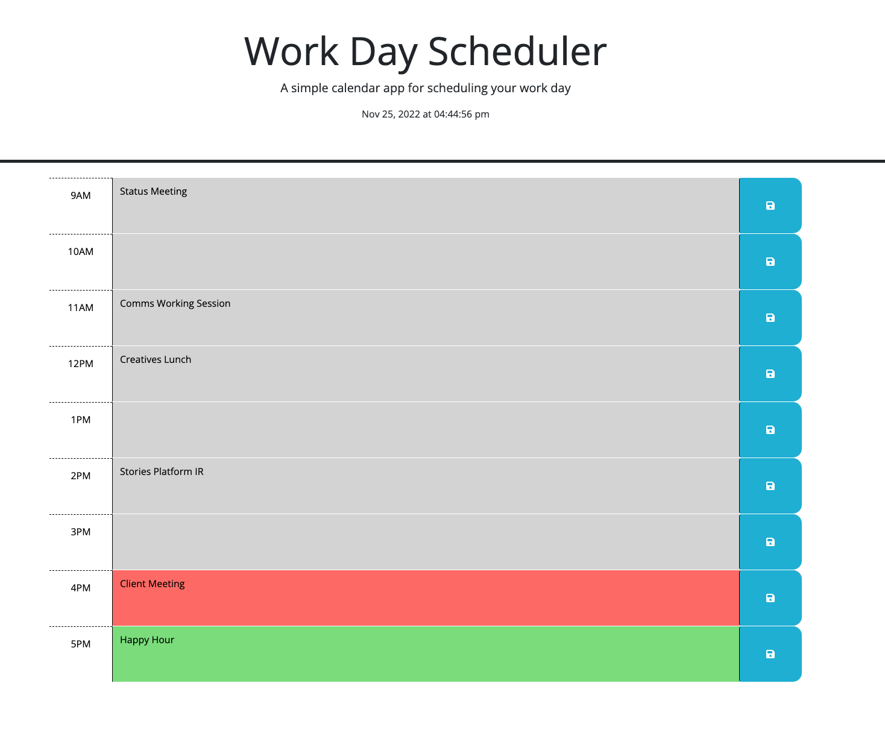

# Work Day Schduler

This was my first challenge using jquery and Bootstrap to create a work day scheduler.

A lot of the features and methods used were similar to those in this week's Mini Project, so using classes and IDs provided to write the functions and event listeners in this .js file was a good reinforcement of what we learned.

As specified in the Challenge Acceptance Criteria, the scheduler achieves the following:

✨ Current day (and time) is displayed at the top of the calendar.

✨ Time blocks for standard business hours.

✨ Each time block is color-coded to indicate whether it is in the past, present or future.

✨ Events can be entered and saved into each time block via local storage.

✨ Saved events persist upon refresh.

Below is a screenshot of my latest and greatest:

To make your next workday schedule, visit https://willbrennana.github.io/05_work-day-scheduler/
